# Python-Beispielsammlung

Dies ist eine Sammlung von **12 eigenständigen Python-Projekten**, jeweils in einem eigenen Unterordner organisiert. Die Projekte decken verschiedene Themen ab – von GUI-Anwendungen mit Tkinter bis hin zu Web-APIs mit Flask und Blockchain-Demos mit Web3.

---

## Projekte im Überblick

### [1. Bestätigungsdialog](./Bestaetigungsdialog)
Eine einfache Tkinter-Anwendung mit Hauptfenster und Button, der einen nicht-modalen Bestätigungsdialog („Ja“ / „Nein“) öffnet.

---

### [2. Bildverarbeitung](./Bildverarbeitung)
Tkinter-basierte Anwendung zur Bildverarbeitung mit OpenCV – u. a. Graustufen, Kantenfilter, Unschärfe.

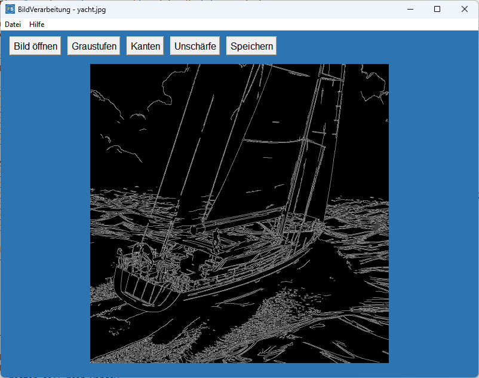

---

### [3. Blockchain](./Blockchain)
Tkinter-Frontend zur Interaktion mit einer lokalen Ganache-Blockchain.  
Funktionen: Verbindung herstellen, Kontostände anzeigen, Transaktionen senden.

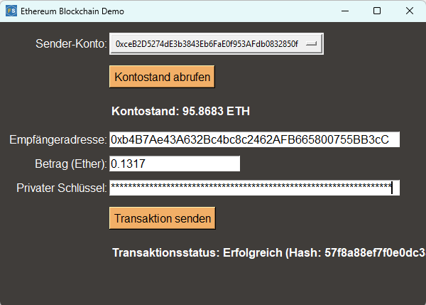

---

### [4. Blog](./Blog)
Flask-Webanwendung mit SQLite zur Verwaltung von Blog-Posts (Erstellen, Bearbeiten, Löschen, Anzeigen).

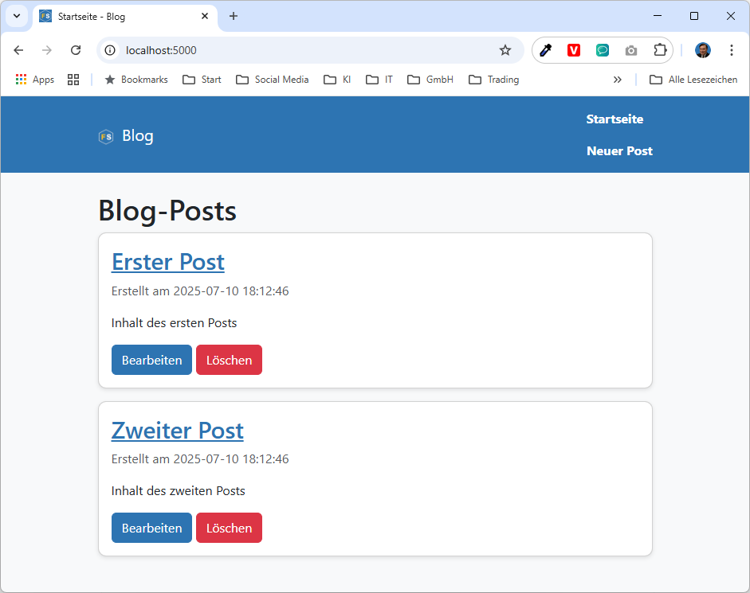

---

### [5. Chatbot](./Chatbot)
Einfache Flask-Webanwendung mit einem rudimentären, regelbasierten Chatbot Simulator.

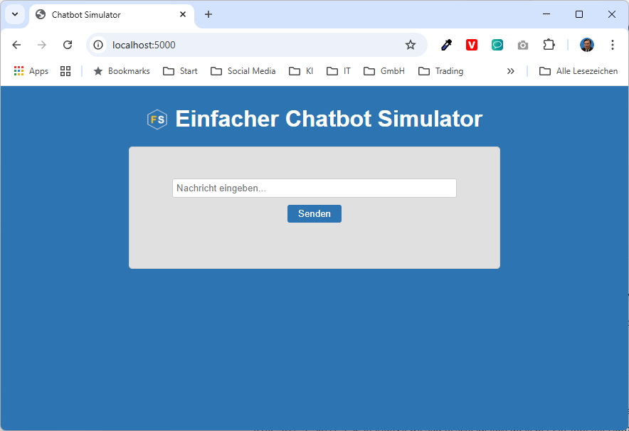

---

### [6. Eingabedialog](./Eingabedialog)
Tkinter-Anwendung mit Eingabefeld. Der eingegebene Text wird im Hauptfenster angezeigt.

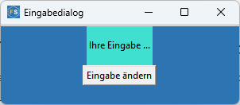

---

### [7. Finanzdatenanzeige](./Finanzdatenanzeige)
Tkinter-Tool zur Anzeige von Bankdaten im CSV-Format in Tabellenform.

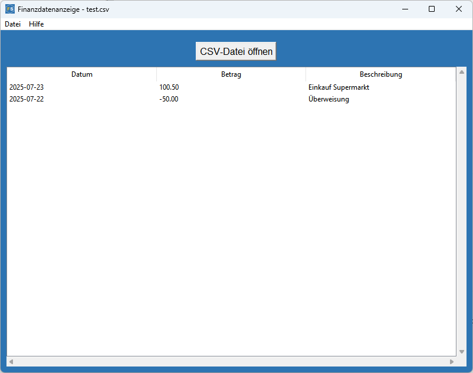

---

### [8. Funktionsdialog](./Funktionsdialog)
Tkinter-Anwendung mit Texteditor und Menü für verschiedene Werkzeuge:
- Uhr (digital)
- Fortschrittsbalken
- System-Kalkulator
- Bildbetrachter (JPEG, PNG)
- Systeminformationen
- Übersetzer-Demo (Platzhalter)

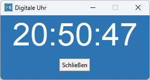

---

### [9. Funktionswerkzeug](./Funktionswerkzeug)
Tkinter-Anwendung mit mehreren Werkzeugen:
- Akronym-Generator  
- BMI-Rechner  
- Farbiger Text  
- Würfel-Simulator  
- Temperaturkonverter (Fahrenheit ↔ Celsius)  
- Passwort-Generator  
- QR-Code-Generator  
- Römische-Zahlen-Konverter

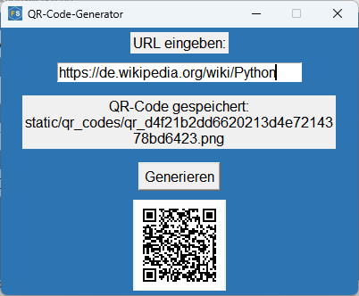

---

### [10. Lizenzpruefer](./Lizenzpruefer)
Python-Tool zur Lizenzprüfung auf Basis von RSA-signierten Lizenzdateien.

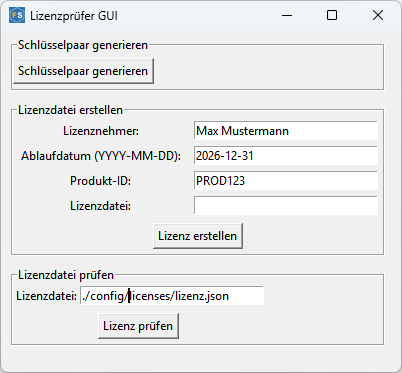

---

### [11. Notizenverwaltung](./Notizenverwaltung)
Flask-basierte REST-API mit SQLite und Weboberfläche zur Notizverwaltung.

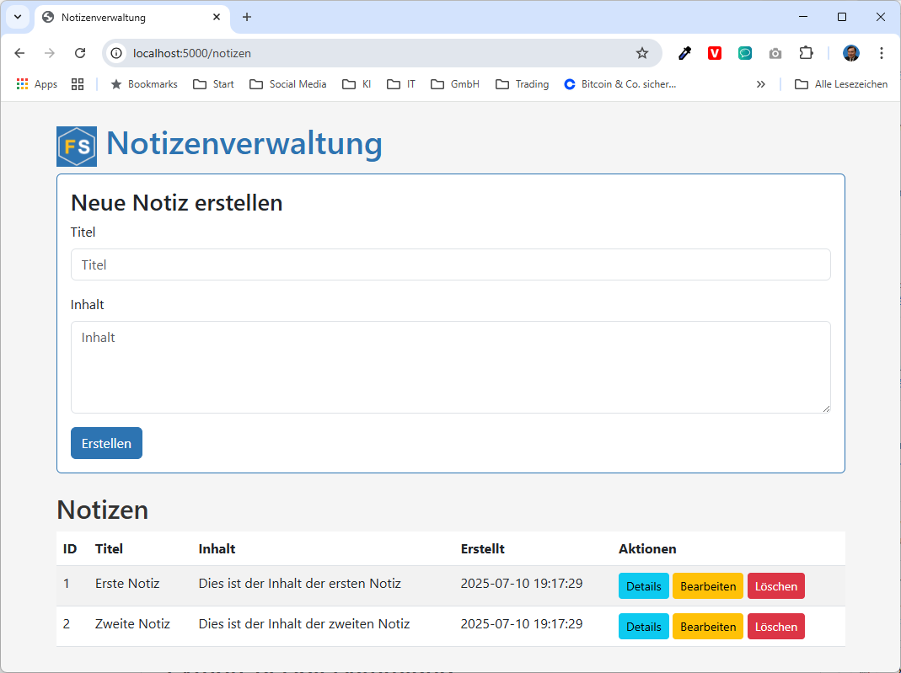

---

### [12. Verschluesselung](./Verschluesselung)
Python-Tool zur symmetrischen AES-Verschlüsselung mit der `cryptography`-Bibliothek.

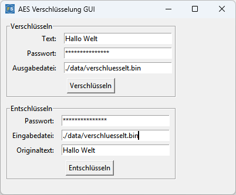

---

## Verwendete Bibliotheken

- **Python 3.13.4 oder höher**
- **Tkinter** (Standardbibliothek)
- **Flask**, **flask-cors**, **requests**
- **OpenCV (opencv-python)**, **Pillow**
- **Ganache (Ethereum-Blockchain)**, **web3**
- **Colorama**, **pyqrcode**, **pypng**
- **Cryptography**

---

## Lizenz

Dieses Repository steht unter der [MIT-Lizenz](./LICENSE). Es ist zu Lernzwecken erstellt. Inhalte und Code dürfen frei verwendet und angepasst werden.
